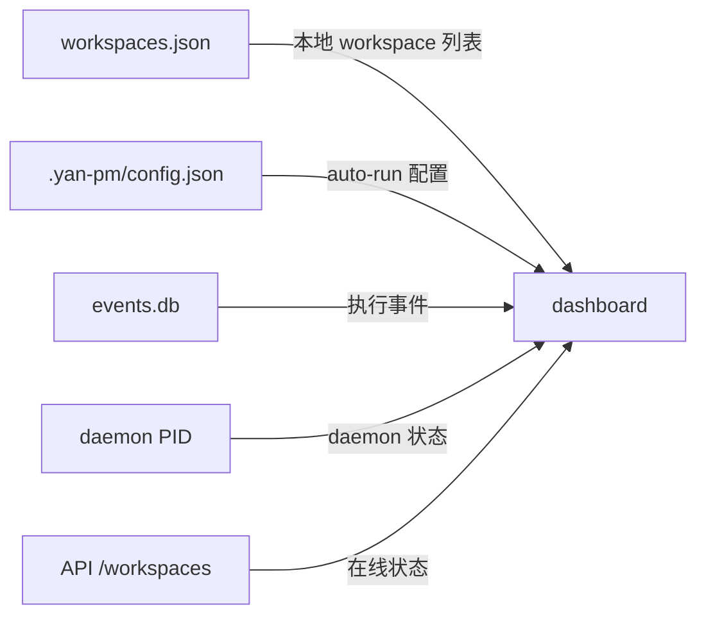
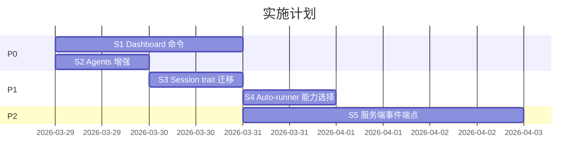

# yan-pm-cli 迭代计划：Workspace Dashboard & Agent 可观测性

> 日期：2026-03-28 | 前置：`docs/devlogs/2026-03-28-architecture-upgrade.md`

## 目标

在架构升级（P0 WAL + P1 状态机 + P2 Backend 注册表）基础上，补齐 CLI 侧的可观测性：让用户在终端即可纵览所有 workspace、agent 状态、执行历史，无需打开 Web 端。

## 范围

| 编号 | 模块 | 说明 | 优先级 |
|------|------|------|--------|
| S1 | `yan-pm dashboard` | 全局 Dashboard 命令 | P0 |
| S2 | `yan-pm agents` 增强 | 展示 capabilities + 运行状态 | P0 |
| S3 | `session.rs` Backend trait 迁移 | 接收 `&dyn AgentBackend` 替代 `AgentDefinition` | P1 |
| S4 | `auto_runner` 能力选择 | 任务分配时用 `find_capable_backend()` | P1 |
| S5 | 服务端事件端点 | POST/GET events API（需协同后端） | P2 |
| S6 | 前端观测台 | Web 消费事件流（另议） | P2 |

本文聚焦 **S1 + S2**，S3/S4 为附带重构，S5/S6 仅列出接口约定。

---

## S1: `yan-pm dashboard` — 全局 Dashboard

### 用户故事

```
作为开发者，我想在终端执行一条命令，看到所有 workspace 的状态概览，
包括每个 workspace 关联的项目、daemon 是否在线、正在跑的 agent 及其执行状态。
```

### 命令设计

```bash
yan-pm dashboard              # 全量 Dashboard
yan-pm dashboard --compact    # 紧凑模式（单行 per workspace）
yan-pm dashboard --json       # JSON 输出（供脚本消费）
```

### 输出示例（默认模式）

```
╭─────────────────────────────────────────────────────────────────╮
│                    yan-pm Dashboard                              │
│                    3 workspaces · daemon ✓                       │
╰─────────────────────────────────────────────────────────────────╯

 ① xiaoyan — /Users/yz/works/yanchat/xiaoyandev
   项目: 小研主站 (active) · auto-run: ON (claude, budget: $10)
   ┌──────────┬────────┬──────────┬────────────┬──────────┐
   │ Agent    │ 任务   │ 状态     │ 耗时       │ 花费     │
   ├──────────┼────────┼──────────┼────────────┼──────────┤
   │ claude   │ #42 登录 │ ● 执行中 │ 3m 22s     │ $0.12   │
   │ claude   │ #38 缓存 │ ✓ 完成   │ 5m 10s     │ $0.08   │
   └──────────┴────────┴──────────┴────────────┴──────────┘

 ② water-ai — /Users/yz/works/water-ai-platform
   项目: 水务 AI 平台 (planning) · auto-run: OFF
   无正在执行的任务

 ③ yan-pm-cli — /Users/yz/works/yanchat/yan-pm-cli
   项目: yan-pm CLI (active) · auto-run: OFF
   无正在执行的任务

  汇总: 1 running · 1 completed · $0.20 total
```

### 紧凑模式

```
Workspace             Project         Daemon  Auto  Running  Done  Cost
xiaoyandev            小研主站         ✓       ON    1        12    $2.40
water-ai-platform     水务 AI 平台     ✓       OFF   0        0     $0.00
yan-pm-cli            yan-pm CLI      ✓       OFF   0        3     $0.36
```

### 数据来源



| 数据 | 来源 | 离线可用 |
|------|------|----------|
| Workspace 列表 | `~/.config/yan-pm-cli/workspaces.json` | ✅ |
| 项目名称/状态 | 本地 `.yan-pm/config.json` 或 API | ✅（降级） |
| Daemon 状态 | PID 文件检查 | ✅ |
| Auto-run 配置 | `.yan-pm/config.json` | ✅ |
| 正在执行的任务 | EventStore `task_started` 且无 `task_completed/failed` | ✅ |
| 执行历史 | EventStore 全量查询 | ✅ |
| Agent 在线状态 | API `/workspaces` | ❌ |

### 实现要点

1. **新增 `cli/dashboard.rs`**：编排数据收集 + 渲染
2. **EventStore 新增查询**：`query_active_tasks()` — 返回已 started 但未 completed/failed 的事件
3. **EventStore 新增查询**：`query_recent_completed(limit)` — 最近完成的任务
4. **`output/format.rs` 新增**：`print_dashboard()` / `print_dashboard_compact()`
5. **离线降级**：API 不可达时用本地数据，标注 `(offline)` 提示

### 文件变更预估

| 文件 | 变更 |
|------|------|
| `cli/dashboard.rs` | 新增 ~200 行 |
| `cli/mod.rs` | 新增 Dashboard 子命令 |
| `main.rs` | 路由新命令 |
| `daemon/event_store.rs` | +2 查询方法 ~40 行 |
| `output/format.rs` | +2 渲染函数 ~150 行 |

---

## S2: `yan-pm agents` 增强

### 现状

当前 `agents` 命令仅展示 `[Agent, 状态, 命令]` 三列（`cli/agents.rs:10`）。

### 目标

```bash
yan-pm agents                 # 列出所有 agent 及 capabilities
yan-pm agents --running       # 仅显示正在执行的 agent
yan-pm agents --json          # JSON 输出
```

### 输出示例

```
╭─────────────────────────────────────────────────────────────────────────╮
│                         Agents                                         │
╰─────────────────────────────────────────────────────────────────────────╯
┌──────────┬──────────┬─────────┬─────┬─────┬──────────┬──────────────────┐
│ Agent    │ 状态     │ Context │ MCP │ IMG │ Worktree │ 命令             │
├──────────┼──────────┼─────────┼─────┼─────┼──────────┼──────────────────┤
│ claude   │ ✓ 可用   │ 200K    │ ✓   │ ✓   │ ✓        │ claude --acp     │
│ codex    │ ✓ 可用   │ 200K    │ ✓   │ ✗   │ ✗        │ codex --acp      │
│ gemini   │ ✗ 未安装 │ 1M      │ ✓   │ ✓   │ ✗        │ gemini --exp-acp │
└──────────┴──────────┴─────────┴─────┴─────┴──────────┴──────────────────┘

正在执行:
  claude → #42 登录页面重构 (xiaoyandev) · 3m 22s · $0.12
```

### 实现要点

1. `cli/agents.rs` 改为同时调用 `load_agents()` + `list_backends_by_priority()`
2. 合并 `AgentDefinition` 和 `AgentBackend` capabilities 数据
3. 查询 EventStore 获取当前运行中的 agent 执行
4. `--running` 过滤仅展示活跃执行

### 文件变更预估

| 文件 | 变更 |
|------|------|
| `cli/agents.rs` | 重写 ~80 行 |
| `cli/mod.rs` | agents 子命令增加 flags |
| `daemon/event_store.rs` | 复用 S1 的查询方法 |

---

## S3: Session Backend Trait 迁移

### 现状

`session.rs` 中 `execute_agent()` 接收 `&AgentDefinition`，P2 新增的 `AgentBackend` trait 尚未被消费。

### 变更

```rust
// Before
pub async fn execute_agent(
    agent: &AgentDefinition,
    options: AgentOptions,
    event_store: Option<&EventStore>,
) -> Result<AgentResult>

// After
pub async fn execute_agent(
    backend: &dyn AgentBackend,
    options: AgentOptions,
    event_store: Option<&EventStore>,
) -> Result<AgentResult>
```

### 影响范围

| 调用方 | 变更 |
|--------|------|
| `runner/mod.rs` | `find_agent()` → `find_backend()` |
| `daemon/auto_runner.rs` | `find_agent()` → `find_backend()` |
| `cli/start.rs` | 同上 |

---

## S4: Auto-runner 能力选择

### 现状

`auto_runner.rs:399` 用 `find_agent(agent_name)` 按名称硬匹配。

### 变更

当 `config.agent` 为 `"auto"` 时，调用 `find_capable_backend()` 按任务需求自动选择：

```rust
let backend = if agent_name == "auto" {
    // 根据任务元数据推断需求
    let needs_images = task_has_image_attachments(&local_task);
    let needs_mcp = true; // yan-pm MCP always needed
    find_capable_backend(needs_images, needs_mcp, false).await
} else {
    find_backend(agent_name)
};
```

### auto-run 配置扩展

```json
{
  "autoRun": {
    "agent": "auto",       // "auto" | "claude" | "codex" | ...
    "concurrency": 2
  }
}
```

---

## S5: 服务端事件端点（接口约定）

> 本节为与后端协同的接口定义，CLI 侧 `event_uploader.rs` 已实现上报逻辑。

### POST `/api/projects/{projectId}/tasks/{taskId}/events`

```json
{
  "events": [
    {
      "eventType": "task_started",
      "payload": { "agent": "claude", "title": "..." },
      "createdAt": "2026-03-28T10:00:00Z"
    }
  ]
}
```

### GET `/api/projects/{projectId}/tasks/{taskId}/events?afterSeq=0&limit=100`

```json
{
  "events": [...],
  "nextSeq": 42
}
```

---

## 实施顺序



| 阶段 | 任务 | 预计新增/修改行数 | 依赖 |
|------|------|-------------------|------|
| P0 | S1 Dashboard | +~400 行 | EventStore 已就绪 |
| P0 | S2 Agents 增强 | +~80 行 | Backend trait 已就绪 |
| P1 | S3 Session 迁移 | ~30 行修改 | S2 完成 |
| P1 | S4 能力选择 | ~40 行修改 | S3 完成 |
| P2 | S5 事件端点 | 后端工作 | S1 完成 |

## 不做的事

- TUI 实时刷新（ratatui/crossterm）— 后续迭代考虑
- Agent 日志流式输出到 Dashboard — 复杂度高，暂不做
- 多机 workspace 聚合 — 当前仅本机视角
- Web 观测台前端 — 另议
