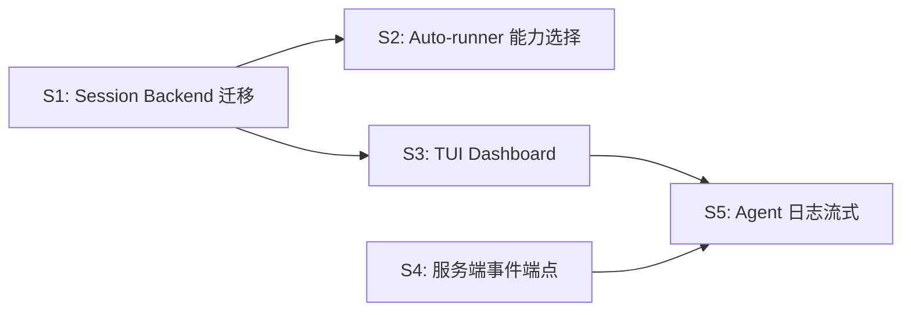

# 迭代计划：可观测性增强 + Backend 多态迁移

> 日期：2026-03-29 | 上游：`devlogs/2026-03-28-architecture-upgrade.md`、`devlogs/2026-03-28-dashboard-agents.md`

## 背景

v0.2.0 完成了 Dashboard CLI + Agents 增强。当前架构有两个未闭合的环：

1. **Session 层仍用 `AgentDefinition`**（P2 定义的 `AgentBackend` trait 未被 session/auto-runner 消费）
2. **事件数据止于本地 SQLite**（`event_uploader` 已实现，但服务端端点不存在，前端无法消费）

本迭代目标：完成 Backend 多态迁移 + 打通事件上报链路 + TUI 实时 Dashboard。

## 优先级

| 编号 | 内容 | 优先级 | 复杂度 |
|------|------|--------|--------|
| S1 | Session Backend trait 迁移 | P0 | 低 |
| S2 | Auto-runner 能力选择 | P0 | 低 |
| S3 | TUI 实时 Dashboard | P1 | 中 |
| S4 | 服务端事件端点 | P1 | 中 |
| S5 | Agent 日志流式输出 | P2 | 高 |

---

## S1: Session Backend trait 迁移（P0）

### 目标

`execute_agent()` 改为接收 `&dyn AgentBackend`，消除 `AgentDefinition` 的冗余间接层。

### 当前状态

```
session.rs: execute_agent(&AgentDefinition, AgentOptions, Option<&ExecutionContext>)
                ↓
            def.command, def.acp_args, def.env  ← 手动字段映射
```

### 目标状态

```
session.rs: execute_agent(&dyn AgentBackend, AgentOptions, Option<&ExecutionContext>)
                ↓
            backend.command(), backend.acp_args(), backend.env_vars()  ← trait 方法
```

### 变更清单

| 文件 | 变更 |
|------|------|
| `agent/session.rs` | `execute_agent` 第一参数改为 `&dyn AgentBackend`，内部调用 trait 方法 |
| `agent/registry.rs` | `AgentDefinition` 实现 `AgentBackend` trait（向后兼容过渡） |
| `runner/mod.rs` | 调用处适配新签名 |
| `daemon/auto_runner.rs` | 调用处适配新签名 |
| `cli/start.rs`（如果存在） | 同上 |

### 兼容策略

- `AgentDefinition` 暂保留并 `impl AgentBackend for AgentDefinition`，让用户自定义 agent 配置仍可工作
- 内置 backend（Claude/Codex/Gemini）优先使用 `backends/` 目录的实现
- 待外部调用方全部迁移后，可移除 `AgentDefinition` 上的 `impl`

---

## S2: Auto-runner 能力选择（P0）

### 目标

任务分配时使用 `find_capable_backend()` 按任务需求自动选择最合适的 Agent。

### 当前状态

```rust
// auto_runner.rs
let agent = find_agent(&config.agent)?;  // 硬编码 agent name
```

### 目标状态

```rust
// auto_runner.rs
let needs = task_capabilities(&task);  // 从任务 metadata 推导需求
let backend = find_capable_backend(needs.images, needs.mcp, needs.worktree)
    .or_else(|| find_backend(&config.agent))  // fallback 到配置
    .ok_or_else(|| anyhow!("no capable agent found"))?;
```

### 变更清单

| 文件 | 变更 |
|------|------|
| `daemon/auto_runner.rs` | 新增 `task_capabilities()` 函数，分配时调用 `find_capable_backend()` |
| `local/task_file.rs`（如果存在） | 任务 frontmatter 增加可选 `requires` 字段（`images`, `mcp`, `worktree`） |

### 能力推导规则

| 任务特征 | 推导 |
|----------|------|
| frontmatter 含 `requires: [mcp]` | `needs_mcp = true` |
| description 含图片附件引用 | `needs_images = true` |
| 无特殊标记 | 全部 false，按优先级选最高可用 agent |

---

## S3: TUI 实时 Dashboard（P1）

### 目标

`yan-pm dashboard --live` 进入 TUI 模式，实时刷新 workspace 状态和 agent 执行进度。

### 技术选型

| 方案 | 优劣 |
|------|------|
| **ratatui + crossterm** | 生态成熟，跨平台，社区活跃 |
| tui-rs | 已 archived，迁移到 ratatui |

选择 **ratatui + crossterm**。

### 功能设计

```
┌─ yan-pm Dashboard ─────────────────────────────────────────────┐
│ Daemon: ● online (pid 12345) · 3 workspaces · 2 agents active │
├────────────────────────────────────────────────────────────────┤
│ [1] xiaoyan  ~/works/xiaoyan   auto:ON  claude                │
│     ● #abc12 优化搜索性能       running 3m 42s   $0.12        │
│     ✓ #def34 修复登录 bug       2m ago           $0.08        │
│                                                                │
│ [2] yan-pm-cli  ~/works/yan-pm  auto:OFF                      │
│     (idle)                                                     │
├────────────────────────────────────────────────────────────────┤
│ q:退出  r:刷新  ↑↓:选择  enter:详情  a:auto-run 开关          │
└────────────────────────────────────────────────────────────────┘
```

### 变更清单

| 文件 | 变更 |
|------|------|
| `Cargo.toml` | +`ratatui`, `crossterm` 依赖 |
| `cli/dashboard.rs` | 新增 `run_tui()` 入口，`--live` flag |
| `tui/mod.rs` | **新增** TUI 模块入口 |
| `tui/app.rs` | **新增** App state + event loop（tick 1s） |
| `tui/ui.rs` | **新增** 渲染函数（Layout → Blocks → Table） |
| `main.rs` | `Dashboard` 增加 `--live` flag |

### 刷新策略

- **Tick 间隔**：1s（EventStore 轮询 + PID 检查）
- **事件驱动**：keyboard input 立即响应，不等 tick
- **数据源复用**：`dashboard.rs` 已有的 `collect_workspace_data()` 直接调用

### 交互

| 键 | 功能 |
|----|------|
| `q` / `Esc` | 退出 TUI |
| `r` | 立即刷新 |
| `↑` / `↓` | 选择 workspace |
| `Enter` | 查看 workspace 详情（展开任务列表） |
| `a` | 切换选中 workspace 的 auto-run 开关 |

---

## S4: 服务端事件端点（P1）

### 目标

实现 `/api/projects/{pid}/tasks/{tid}/events` 端点，让 `event_uploader` 的数据有落脚点，前端可消费。

### 端点设计

```
POST /api/projects/:pid/tasks/:tid/events
  Body: { events: [{ event_type, payload, created_at }] }
  Response: { synced: number }

GET /api/projects/:pid/tasks/:tid/events
  Query: ?after=<seq>&limit=50
  Response: { events: [...], has_more: boolean }
```

### 变更清单（服务端 — xiaoyandev）

| 文件 | 变更 |
|------|------|
| `packages/server/src/routes/task-events.ts` | **新增** POST/GET 路由 |
| `packages/server/src/db/schema/task-events.ts` | **新增** Drizzle schema |
| `packages/server/src/db/migrations/` | 生成迁移 SQL |

### 变更清单（CLI 端）

| 文件 | 变更 |
|------|------|
| `api/client.rs` | 调整 `post_raw()` 调用路径匹配新端点 |
| `daemon/event_uploader.rs` | 确认 payload 格式与端点对齐 |

---

## S5: Agent 日志流式输出（P2）

### 目标

Dashboard TUI 中可实时查看选中 agent 的执行日志（tool calls、输出片段）。

### 复杂度分析

当前 `session.rs` 将 agent 输出缓存在内存中（1MB cap），完成后一次性返回。流式输出需要：

1. Agent 输出实时写入 EventStore（`tool_call`, `tool_result` 已有）
2. TUI 持续轮询 `event_store.query(task_id, after_seq, limit)` 获取增量
3. 渲染日志窗口（滚动 + 搜索）

### 方案

- **阶段 1**：TUI 中展示已有的 `tool_call` 事件序列（无需改 session）
- **阶段 2**：session 增加 `agent_output` 事件类型，流式写入 stdout 片段
- **阶段 3**：日志窗口支持搜索、过滤、导出

### 不做

- 不做 WebSocket 推送到浏览器（属于 Web 观测台范畴，另议）
- 不做多机日志聚合（当前仅本机视角）

---

## 依赖关系



## 实施顺序

1. **S1 + S2**（P0，无外部依赖，可并行开发）
2. **S3**（P1，依赖 S1 完成后 dashboard 数据结构稳定）
3. **S4**（P1，可与 S3 并行，涉及 xiaoyandev 仓库）
4. **S5**（P2，依赖 S3 + S4）

## 不做

- Web 观测台前端 — 属于 xiaoyandev 前端范畴，需独立设计文档
- 多机 workspace 聚合 — 当前仅本机视角，需要先定义跨机通信协议
- Agent 编排（多 agent 协作） — 超出当前迭代范围
