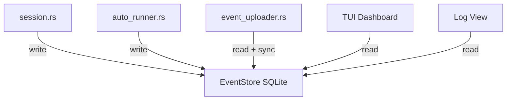

# 开发计划：可观测性增强 + Backend 多态迁移

> 日期：2026-03-29 | 基于：`plans/2026-03-29-iteration-observability.md`

## 概览

本计划将迭代文档中的 5 个工作项拆解为可执行的开发步骤，重点关注设计决策、风险点和跨仓库协调。

### 交付物

| 阶段 | 交付 | 仓库 | 预估 |
|------|------|------|------|
| Phase 1 | S1 + S2：Backend 多态迁移 | yan-pm-cli | 1-2 天 |
| Phase 2 | S3：TUI 实时 Dashboard | yan-pm-cli | 2-3 天 |
| Phase 3 | S4：服务端事件端点 | xiaoyandev + yan-pm-cli | 1-2 天 |
| Phase 4 | S5：Agent 日志流式输出 | yan-pm-cli | 2-3 天 |

---

## Phase 1: Backend 多态迁移（S1 + S2）

### 设计要点

**S1 核心变更：`execute_agent` 签名迁移**

当前 `session.rs:execute_agent` 接收 `&AgentDefinition`，内部手动映射字段到 ACP 启动参数。目标是改为接收 `&dyn AgentBackend`，让 trait 方法驱动所有行为。

关键设计决策：

1. **向后兼容过渡** — `AgentDefinition` 保留并 `impl AgentBackend`，这样用户通过 `agents.toml` 自定义的 agent 仍然可用。但需要注意 `AgentDefinition` 没有 `capabilities()` 的数据源，需要给一个保守的默认值（全 false）。

2. **trait object vs 泛型** — 选择 `&dyn AgentBackend` 而非泛型 `impl AgentBackend`。原因：
   - `auto_runner.rs` 需要在运行时动态选择 backend
   - 调用链涉及跨线程 spawn（ACP 要求 `!Send` 的 OS 线程），泛型单态化在此场景无收益
   - trait 已有 `Send + Sync` bound，满足 `Arc<dyn AgentBackend>` 的使用场景

3. **`find_capable_backend()` 放在 `agent/registry.rs`** 而非 `auto_runner.rs`，因为 backend 发现是 agent 层的职责。auto_runner 只负责描述需求。

**S2 核心变更：能力选择**

`task_capabilities()` 从任务 metadata 推导需求，设计上需要考虑：

- **推导来源优先级**：frontmatter `requires` 字段 > 描述文本启发式匹配 > 默认（全 false）
- **fallback 策略**：能力匹配失败时，回退到配置文件指定的 agent，而非直接报错。这保证了用户显式配置始终被尊重
- **任务文件格式**：`local/task_file.rs` 的 frontmatter 新增可选 `requires` 字段，类型为 `Vec<String>`

### 实施步骤

```
S1-1. agent/registry.rs: 为 AgentDefinition 实现 AgentBackend trait
      - capabilities() 返回保守默认值
      - build_prompt() 复用现有逻辑
      - priority() 返回 999（低于内置 backend）

S1-2. agent/session.rs: execute_agent 签名变更
      - 第一参数 &AgentDefinition → &dyn AgentBackend
      - 内部 def.command → backend.command() 等 trait 方法调用
      - 编译验证所有调用处

S1-3. runner/mod.rs + daemon/auto_runner.rs: 适配新签名
      - runner: find_agent() 返回 Arc<dyn AgentBackend>
      - auto_runner: 同上

S2-1. local/task_file.rs: frontmatter 增加 requires 字段
S2-2. daemon/auto_runner.rs: 新增 task_capabilities() + 调用 find_capable_backend()
```

### 风险与缓解

| 风险 | 影响 | 缓解 |
|------|------|------|
| `AgentDefinition` 的 `impl AgentBackend` 缺少字段 | 能力匹配不准确 | 默认全 false，保守匹配 |
| 调用链中 lifetime 问题 | 编译失败 | `Arc<dyn AgentBackend>` 统一所有权 |
| 用户自定义 agent 行为变化 | 回归 | 现有 agent 走 `AgentDefinition` impl 路径，行为不变 |

### 验证标准

- `cargo test` 全部通过
- 手动测试：`yan-pm run` 使用内置 backend（claude）执行任务
- 手动测试：`agents.toml` 自定义 agent 仍然可用
- `auto_runner` 在无 `requires` 字段时 fallback 到配置 agent

---

## Phase 2: TUI 实时 Dashboard（S3）

### 设计要点

**架构分层**

```
cli/dashboard.rs          — 入口，--live flag 判断走 TUI 还是静态输出
    ↓
tui/mod.rs                — 模块入口 + Terminal 初始化/恢复
tui/app.rs                — App state + event loop + 业务逻辑
tui/ui.rs                 — 纯渲染函数（接收 &App, &mut Frame）
tui/event.rs              — 事件抽象（Tick / Key / Resize）
```

关键设计决策：

1. **数据源复用** — `dashboard.rs` 已有 `collect_workspace_data()` 返回 `DashboardData`，TUI 直接复用。不引入新的数据获取路径。

2. **事件循环模型** — 双线程：
   - 主线程：ratatui 渲染 + 键盘事件处理
   - 后台线程：1s tick 触发数据刷新
   - 通过 `mpsc::channel` 传递 `AppEvent`（Tick / Key / Resize）

3. **Terminal 恢复保障** — TUI 程序崩溃时必须恢复终端状态。使用 `std::panic::set_hook` + `Drop` trait 双重保障，避免终端残留 raw mode。

4. **渲染无副作用** — `ui.rs` 的渲染函数是纯函数，只读 `App` state。所有状态变更在 `app.rs` 的事件处理中完成。

**Layout 设计**

```
┌─ Header (1 行) ──────────────────────────────────────┐
│ Daemon status · workspace count · active agents       │
├─ Workspace List (动态高度) ───────────────────────────┤
│ 每个 workspace 一个 Block：                           │
│   名称 + 路径 + auto-run 状态                         │
│   active tasks (Table: id | title | status | time)    │
│   recent completed (折叠，Enter 展开)                 │
├─ Footer (1 行) ──────────────────────────────────────┤
│ 快捷键提示                                            │
└──────────────────────────────────────────────────────┘
```

**依赖选择**

| crate | 版本 | 用途 |
|-------|------|------|
| `ratatui` | 0.29+ | TUI 框架 |
| `crossterm` | 0.28+ | 终端后端 |

不引入额外 TUI 辅助 crate（如 tui-textarea），保持依赖精简。

### 实施步骤

```
S3-1. Cargo.toml: 添加 ratatui + crossterm 依赖
S3-2. tui/app.rs: App state + 事件循环（crossterm::event::poll + read，无需单独事件线程）
      - selected_workspace: usize
      - expanded: HashSet<usize>
      - data: DashboardData
      - should_quit: bool
      - 主循环：poll(tick_rate) → read() → update() → draw()
S3-3. tui/ui.rs: 渲染函数（纯函数，接收 &App, &mut Frame）
      - render_header()
      - render_workspace_list()
      - render_footer()
S3-4. tui/mod.rs: Terminal 初始化/恢复 + panic hook
S3-5. cli/dashboard.rs: --live flag → run_tui() 入口
S3-6. main.rs: Dashboard subcommand 增加 --live flag
```

### 风险与缓解

| 风险 | 影响 | 缓解 |
|------|------|------|
| 终端崩溃后 raw mode 残留 | 终端不可用 | panic hook + Drop 双重恢复 |
| EventStore 轮询频率过高 | SQLite 锁竞争 | 1s tick 足够低频，WAL 模式支持并发读 |
| 大量 workspace 超出屏幕 | 显示不全 | 添加滚动支持（ratatui ScrollbarState） |

### 验证标准

- `--live` 进入 TUI，`q` 正常退出，终端状态恢复
- 实时显示 daemon 状态和 workspace 信息
- `↑↓` 选择 workspace，`Enter` 展开/折叠
- `a` 切换 auto-run 后状态立即刷新
- `r` 手动刷新数据

---

## Phase 3: 服务端事件端点（S4）

### 设计要点

**跨仓库协调**

本阶段涉及 xiaoyandev（服务端）和 yan-pm-cli（客户端）两个仓库。需要先定义并冻结 API 契约，再分头实施。

**API 契约**

```
POST /api/projects/:pid/tasks/:tid/events
  Headers: Authorization: Bearer <token>
  Body: {
    "events": [
      {
        "event_type": "tool_call" | "tool_result" | "task_started" | ...,
        "payload": "{ ... }",       // JSON string，保持灵活性
        "created_at": "ISO8601",
        "local_id": 12345           // 客户端本地 ID，用于幂等
      }
    ]
  }
  Response 200: { "synced": 3 }
  Response 409: { "duplicates": [12345] }  // 幂等重试

GET /api/projects/:pid/tasks/:tid/events
  Query: ?after=<server_seq>&limit=50&type=tool_call
  Response 200: {
    "events": [...],
    "has_more": true,
    "next_cursor": "seq:456"
  }
```

关键设计决策：

1. **幂等性** — `local_id` 字段确保重复上传不会产生重复记录。客户端 retry 时无需担心副作用。服务端用 `(task_id, local_id)` 做唯一约束。

2. **payload 为 JSON string** — 不做结构化校验，保持前向兼容。新增事件类型不需要改 schema。

3. **Cursor 分页** — GET 端点使用 cursor 而非 offset，避免数据插入导致分页偏移。cursor 为服务端序列号。

4. **type 过滤** — GET 支持可选 `type` query param，前端可只拉 `tool_call` 事件用于日志展示，减少带宽。

**数据库设计（xiaoyandev 侧）**

| 列 | 类型 | 说明 |
|----|------|------|
| id | serial | 服务端序列号 |
| task_id | text | 关联任务 |
| project_id | text | 关联项目 |
| event_type | text | 事件类型 |
| payload | jsonb | 事件负载 |
| local_id | bigint | 客户端本地 ID |
| created_at | timestamptz | 事件发生时间 |
| received_at | timestamptz | 服务端接收时间 |

索引：`(task_id, id)`, `(task_id, local_id) UNIQUE`

### 实施步骤

```
--- xiaoyandev 仓库 ---
S4-1. packages/server/src/db/schema/task-events.ts: Drizzle schema
S4-2. 生成迁移 SQL（pnpm db:generate）
S4-3. packages/server/src/routes/task-events.ts: POST + GET 路由
      - POST: 批量插入，幂等处理，返回 synced 数量
      - GET: cursor 分页，可选 type 过滤
S4-4. 路由注册到 Hono app

--- yan-pm-cli 仓库 ---
S4-5. api/client.rs: 确认 post_raw() 路径与新端点一致
S4-6. daemon/event_uploader.rs: 重构上传 payload
      - 发送完整事件记录 { event_type, payload, created_at, local_id }（而非仅 payload）
      - local_id 使用复合格式 "{daemon_session_id}:{sqlite_rowid}"，daemon 启动时生成 UUID session_id
      - 确保跨 daemon 重启不会产生 local_id 冲突
S4-7. 端到端测试：CLI 上报事件 → 服务端存储 → GET 查询验证
```

### 风险与缓解

| 风险 | 影响 | 缓解 |
|------|------|------|
| 大量事件写入导致 DB 压力 | 服务端延迟 | 批量插入 + 客户端节流（50/batch） |
| payload 格式不一致 | 前端解析失败 | payload 为 JSON string，前端容错处理 |
| 网络中断导致事件丢失 | 数据不完整 | 客户端本地 SQLite 持久化 + 重试 |

### 验证标准

- POST 端点：正常写入返回 200 + synced 数量
- POST 端点：重复 local_id 返回 409 或静默跳过
- GET 端点：cursor 分页正确，has_more 准确
- CLI event_uploader 成功上报并 mark_synced
- 前端可通过 GET 端点获取事件列表

---

## Phase 4: Agent 日志流式输出（S5）

### 设计要点

**分阶段推进**

这是复杂度最高的工作项，分三个子阶段，每个阶段独立可交付：

**阶段 1：展示已有 `tool_call` 事件**

TUI Dashboard 中选中任务后，展示该任务的 `tool_call` / `tool_result` 事件序列。数据已存在于 EventStore，无需修改 session。

设计：
- `tui/app.rs` 新增 `LogView` 状态（task_id, last_seq, events buffer）
- 每次 tick 调用 `event_store.query(task_id, last_seq, 50)` 获取增量
- `tui/ui.rs` 新增 `render_log_panel()` — 右侧 split 或全屏覆盖

**阶段 2：session 增加 `agent_output` 事件**

当前 session 将 stdout 缓存在内存（1MB cap），完成后一次性返回。需要改为流式写入 EventStore。

设计考量：
- **粒度**：按行写入太频繁，按 chunk（4KB 或 100ms 节流）写入。每个 chunk 一条 `agent_output` 事件
- **内存 buffer 保留**：仍需 1MB buffer 用于最终结果返回，流式写入是增量行为
- **EventStore 压力**：高频写入可能影响 WAL checkpoint。可配置 `enable_streaming` 开关，默认关闭

**阶段 3：日志窗口增强**

- 关键字搜索（`/` 触发搜索模式）
- 事件类型过滤（`f` 切换过滤器）
- 日志导出到文件（`e` 导出）

### 实施步骤

```
--- 阶段 1 ---
S5-1. tui/app.rs: LogView state + Enter on task → 进入日志视图
S5-2. tui/ui.rs: render_log_panel() — 事件列表 + 自动滚动
S5-3. tui/app.rs: Tick 时增量查询 EventStore

--- 阶段 2 ---
S5-4. agent/session.rs: 在 AgentMessageChunk 分支中直接写入 EventStore
      - 新增 EventType::AgentOutput
      - 无需节流——ACP chunk 频率（每秒几次）远低于 SQLite WAL 性能上限
      - 保留现有 1MB 内存 buffer 用于最终结果返回
S5-5. daemon/event_store.rs: 注意 WAL 并发风险（概率低，但需监控）

--- 阶段 3 ---
S5-7. tui/ui.rs: 搜索 + 过滤 UI
S5-8. tui/app.rs: 搜索/过滤状态管理
S5-9. 日志导出功能
```

### 风险与缓解

| 风险 | 影响 | 缓解 |
|------|------|------|
| 高频 EventStore 写入 | WAL 膨胀、锁竞争 | 节流 + 默认关闭 streaming |
| 日志量过大撑爆 TUI buffer | 内存增长 | 环形 buffer，保留最近 1000 条 |
| session 改动引入回归 | agent 执行失败 | 阶段 1 不改 session，风险为零 |

### 验证标准

- 阶段 1：TUI 中选中运行中的任务，能看到 tool_call 事件实时追加
- 阶段 2：开启 streaming 后，agent 输出按 chunk 出现在日志视图
- 阶段 3：`/` 搜索、`f` 过滤、`e` 导出均正常工作

---

## 跨阶段设计约束

### 1. EventStore 是核心数据总线



所有可观测性数据通过 EventStore 流转。这意味着：
- EventStore 的 schema 变更需要考虑所有消费者
- 新增 EventType 必须向后兼容（未知类型静默跳过）
- compact() 策略需要与 event_uploader 协调（只删已 synced 的）

### 2. 不做的事情（边界明确）

| 不做 | 原因 |
|------|------|
| Web 观测台前端 | 属于 xiaoyandev 前端，需独立设计 |
| WebSocket 实时推送 | 本迭代聚焦 CLI 侧，Web 另议 |
| 多机聚合 | 需要先定义跨机通信协议 |
| Agent 编排（多 agent 协作） | 超出迭代范围 |

### 3. 测试策略

| 层级 | 策略 |
|------|------|
| 单元测试 | `AgentBackend` trait 的 mock impl + `task_capabilities()` 推导逻辑 |
| 集成测试 | EventStore 读写 + 查询（tempfile SQLite） |
| 端到端 | CLI → 服务端事件上报（需 dev server 运行） |
| TUI 测试 | 手动验证为主，ratatui 的 `TestBackend` 用于布局回归 |

**具体测试清单（Eng Review 补充）：**

| Phase | 测试文件 | 断言 |
|-------|---------|------|
| P1 | `tests/agent_backend_test.rs` | `AgentDefinition` impl `AgentBackend` 后 `capabilities()` 返回保守默认值（全 false） |
| P1 | `tests/agent_backend_test.rs` | `find_backend()` fallback：capable 匹配失败 → 配置 agent 仍可用 |
| P2 | `tests/task_capabilities_test.rs` | `task_capabilities()` 推导：有 `requires: [mcp]` → `needs_mcp=true`；无 requires → 全 false |
| P3 | `tests/event_uploader_test.rs` | uploader 发送完整事件记录（含 event_type, created_at, local_id） |
| P3 | `tests/event_uploader_test.rs` | 复合 local_id 格式正确：`{session_id}:{rowid}` |
| P2 | `tests/tui_test.rs` | App state: select/expand/quit 状态转换正确（使用 ratatui TestBackend） |

### 4. 发布计划

- Phase 1 完成后发 **v0.3.0-alpha**（backend 迁移，内部里程碑）
- Phase 2 完成后发 **v0.3.0-beta**（TUI dashboard 可体验）
- Phase 3 + 4 完成后发 **v0.3.0**（完整可观测性链路）

## GSTACK REVIEW REPORT

| Review | Trigger | Why | Runs | Status | Findings |
|--------|---------|-----|------|--------|----------|
| CEO Review | `/plan-ceo-review` | Scope & strategy | 0 | — | — |
| Codex Review | `/codex review` | Independent 2nd opinion | 0 | — | — |
| Eng Review | `/plan-eng-review` | Architecture & tests (required) | 1 | CLEAR (PLAN) | 7 issues, 0 critical gaps |
| Design Review | `/plan-design-review` | UI/UX gaps | 0 | — | — |

- **UNRESOLVED:** 0 decisions
- **VERDICT:** ENG CLEARED — 7 issues found, all resolved inline. Plan updated with: uploader payload fix, composite local_id, TUI event model simplification, streaming simplification, test checklist.
