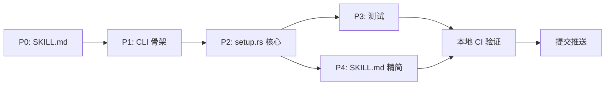

# yan-pm-cli setup 实施方案

基于 `docs/setup-command-design.md` 设计方案。

## 文件变更清单

| 文件 | 操作 | 说明 |
|------|------|------|
| `SKILL.md` | 新建 | 项目根目录，从 `packages/yan-pm-skill/SKILL.md` 迁移并精简 |
| `crates/yan-pm/src/cli/setup.rs` | 新建 | setup 命令核心实现（~400 行） |
| `crates/yan-pm/src/cli/mod.rs` | 修改 | 添加 `pub mod setup;` + `Setup` 子命令枚举 |
| `crates/yan-pm/src/main.rs` | 修改 | 添加 `Commands::Setup` 分发 |
| `crates/yan-pm/tests/integration_test.rs` | 修改 | 添加 setup 命令测试 |

## 实施步骤

### P0: SKILL.md 准备

将现有 `packages/yan-pm-skill/SKILL.md` 复制到 yan-pm-cli 项目根目录，调整内容：
- 移除 MCP 手动配置指引（setup 命令会自动处理）
- 保留 MCP tools 表、工作流、状态机、最佳实践
- 添加说明："此文件由 `yan-pm-cli setup` 自动安装到 AI 工具目录"

### P1: CLI 骨架

**`src/cli/mod.rs` — 添加枚举**

```rust
/// 安装 yan-pm 到 AI 工具（Claude Code / VS Code / Cursor）
Setup {
    /// 指定目标工具
    #[arg(long, value_enum)]
    target: Option<SetupTarget>,

    /// 卸载配置
    #[arg(long)]
    uninstall: bool,

    /// 查看安装状态
    #[arg(long)]
    status: bool,

    /// 手动指定 yan-pm-cli 二进制路径
    #[arg(long)]
    binary_path: Option<String>,

    /// MCP 注册范围 (仅 Claude Code)
    #[arg(long, default_value = "user")]
    scope: SetupScope,

    /// 跳过确认提示
    #[arg(long)]
    yes: bool,
},

#[derive(Clone, ValueEnum)]
pub enum SetupTarget {
    Claude,
    Vscode,
    Cursor,
}

#[derive(Clone, ValueEnum)]
pub enum SetupScope {
    User,
    Project,
}
```

**`src/main.rs` — 添加分发**

```rust
Commands::Setup { target, uninstall, status, binary_path, scope, yes } => {
    if status {
        cli::setup::status().await
    } else if uninstall {
        cli::setup::uninstall(target.as_ref()).await
    } else {
        cli::setup::install(target.as_ref(), binary_path.as_deref(), &scope, yes).await
    }
}
```

### P2: setup.rs 核心实现

模块内部结构：

```
src/cli/setup.rs
├── pub async fn install(target, binary_path, scope, yes)
├── pub async fn uninstall(target)
├── pub async fn status()
├── fn detect_tools() -> Vec<DetectedTool>       // 检测已安装的 AI 工具
├── fn resolve_binary_path(override) -> Result<String>  // 解析二进制路径
├── fn setup_claude(binary, scope) -> Result<()>  // Claude Code 安装
├── fn setup_vscode(binary, scope) -> Result<()>  // VS Code 安装
├── fn setup_cursor(binary) -> Result<()>          // Cursor 安装
├── fn install_skill() -> Result<()>               // 写 SKILL.md
├── fn remove_claude() -> Result<()>               // Claude Code 卸载
├── fn remove_vscode() -> Result<()>               // VS Code 卸载
├── fn remove_cursor() -> Result<()>               // Cursor 卸载
├── fn check_claude_status() -> ToolStatus         // 状态检测
├── fn check_vscode_status() -> ToolStatus
├── fn check_cursor_status() -> ToolStatus
└── const SKILL_CONTENT: &str = include_str!("../../../SKILL.md")  // 编译时嵌入
```

#### 关键函数实现要点

**`detect_tools()`**

```rust
struct DetectedTool {
    target: SetupTarget,
    name: &'static str,
    path: String,  // claude 命令路径 or 配置目录
}

fn detect_tools() -> Vec<DetectedTool> {
    let mut tools = vec![];

    // Claude Code: 检查 claude 命令是否在 PATH
    if let Ok(output) = std::process::Command::new("which").arg("claude").output() {
        if output.status.success() {
            tools.push(DetectedTool { target: Claude, name: "Claude Code", path: ... });
        }
    }
    // 回退: 检查 ~/.claude/ 目录是否存在
    else if home_dir().join(".claude").exists() { ... }

    // VS Code: 检查 ~/.vscode/ 目录
    if home_dir().join(".vscode").exists() { ... }

    // Cursor: 检查 ~/.cursor/ 目录
    if home_dir().join(".cursor").exists() { ... }

    tools
}
```

**`setup_claude(binary, scope)`**

```rust
fn setup_claude(binary: &str, scope: &SetupScope) -> Result<()> {
    let scope_str = match scope {
        SetupScope::User => "user",
        SetupScope::Project => "project",
    };

    // 1. 尝试 claude mcp add
    let result = std::process::Command::new("claude")
        .args(["mcp", "add", "--transport", "stdio", "--scope", scope_str, "yan-pm", "--", binary, "mcp"])
        .output();

    match result {
        Ok(output) if output.status.success() => {
            println!("✓ MCP Server 已注册 (scope: {scope_str})");
        }
        _ => {
            // 回退: 直接写 ~/.claude.json
            write_claude_json_fallback(binary, scope)?;
            println!("✓ MCP Server 已注册 (写入 ~/.claude.json)");
        }
    }

    // 2. 安装 Skill
    install_skill()?;
    println!("✓ Skill 已安装");

    Ok(())
}
```

**`setup_vscode(binary, scope)` / `setup_cursor(binary)`**

```rust
fn merge_mcp_json(config_path: &Path, binary: &str) -> Result<()> {
    // 1. 读取已有配置（如果存在）
    let mut config: serde_json::Value = if config_path.exists() {
        let content = std::fs::read_to_string(config_path)?;
        serde_json::from_str(&content).unwrap_or(serde_json::json!({}))
    } else {
        serde_json::json!({})
    };

    // 2. VS Code 用 "servers" key, Cursor 用 "mcpServers" key
    let servers_key = if is_vscode { "servers" } else { "mcpServers" };
    let servers = config.as_object_mut().unwrap()
        .entry(servers_key)
        .or_insert(serde_json::json!({}));

    // 3. 写入 yan-pm 配置
    servers.as_object_mut().unwrap().insert("yan-pm".to_string(), serde_json::json!({
        "type": "stdio",
        "command": binary,
        "args": ["mcp"]
    }));

    // 4. 创建目录（如果不存在）并写回
    if let Some(parent) = config_path.parent() {
        std::fs::create_dir_all(parent)?;
    }
    std::fs::write(config_path, serde_json::to_string_pretty(&config)?)?;

    Ok(())
}
```

**`install_skill()`**

```rust
const SKILL_CONTENT: &str = include_str!("../../../SKILL.md");

fn install_skill() -> Result<()> {
    let skill_dir = home_dir().join(".claude/skills/yan-pm");
    std::fs::create_dir_all(&skill_dir)?;
    std::fs::write(skill_dir.join("SKILL.md"), SKILL_CONTENT)?;
    Ok(())
}
```

**`resolve_binary_path(override_path)`**

```rust
fn resolve_binary_path(override_path: Option<&str>) -> Result<String> {
    // 1. 用户指定
    if let Some(p) = override_path {
        let path = PathBuf::from(p).canonicalize()?;
        anyhow::ensure!(path.exists(), "指定的路径不存在: {p}");
        return Ok(path.to_string_lossy().to_string());
    }

    // 2. 当前二进制路径
    if let Ok(exe) = std::env::current_exe().and_then(|p| p.canonicalize()) {
        let exe_str = exe.to_string_lossy();
        // 警告开发环境路径
        if exe_str.contains("target/debug") || exe_str.contains("target/release") {
            eprintln!("⚠ 当前路径看起来是开发构建: {exe_str}");
            eprintln!("  建议使用 --binary-path 指定安装后的路径");
        }
        return Ok(exe_str.to_string());
    }

    // 3. which 查找
    let output = std::process::Command::new("which").arg("yan-pm-cli").output()?;
    if output.status.success() {
        return Ok(String::from_utf8_lossy(&output.stdout).trim().to_string());
    }

    anyhow::bail!("无法确定 yan-pm-cli 路径，请使用 --binary-path 指定")
}
```

### P3: 测试

**集成测试（`tests/integration_test.rs`）**

```rust
#[test]
fn test_setup_help() {
    cmd()
        .arg("setup")
        .arg("--help")
        .assert()
        .success()
        .stdout(predicate::str::contains("安装"))
        .stdout(predicate::str::contains("--target"))
        .stdout(predicate::str::contains("--uninstall"));
}

#[test]
fn test_setup_status() {
    cmd()
        .arg("setup")
        .arg("--status")
        .assert()
        .success();
}
```

注意：MCP 注册和 Skill 写入涉及真实文件系统，集成测试只测 CLI 接口，不测实际安装。

### P4: SKILL.md 更新

更新 SKILL.md 内容，适配 setup 自动安装场景：

```markdown
---
name: yan-pm
description: |
  YanChat 项目管理助手。...
---

# YanChat 项目管理助手

> 此 Skill 由 `yan-pm-cli setup` 自动安装。更新: `yan-pm-cli setup --target claude`

## 可用 MCP Tools

（保留现有 13 个 tool 表格）

## 工作流

（保留 5 个工作流）

## 任务状态 / 类型 / 优先级

（保留）

## 最佳实践

（保留）
```

移除内容：
- MCP 手动配置指引（setup 自动处理）
- 多工具配置示例（不再需要）

## 实施顺序



预估工作量：~500 行新代码 + SKILL.md 迁移

## 验收标准

1. `yan-pm-cli setup --status` 正确显示各工具安装状态
2. `yan-pm-cli setup --target claude` 成功注册 MCP + 安装 Skill
3. `yan-pm-cli setup --target claude --uninstall` 成功清理
4. `yan-pm-cli setup --yes` 跳过确认直接安装
5. 在 Claude Code 中能通过 MCP 调用 yan-pm 工具
6. 在 Claude Code 中 Skill 被正确识别和触发
7. `cargo fmt --check && cargo clippy -- -D warnings && cargo test --all` 全部通过
